# Weevil Debugger plugin

Weevil Debugger is an extension to existing Intellij Java Debugger providing out-of-the-box features:

<ul>
    <li>Debugger Shell with evaluation history and value inspection</li>
    <li>Automatic closing files which aren't reachable from stack frames during Debug</li>
    <li>Search for Debugger Variables</li>
    <li>Evaluate future code</li>    
    <li>Recursion breakpoint</li>
    <li>Smart breakpoint setup according to current value</li>
    <li>Highlighting boolean operators</li>
    <li>Highlighting selected expression</li>
    <li>Show source code path of loaded class</li>
    <li>Show method return values</li>
    <li>Variable change history</li>
</ul>

## Requirements

For <code>Search</code> and <code>Evaluate future code</code> features, it is required to have a running JVM 
with at least Java 8 version.

If your code is stateful using <code>Evaluate future code</code> feature may cause unexpected program behavior.

## Features

### Debugger Shell

To open Debugger Shell just right-click in the editor after breakpoint hits.

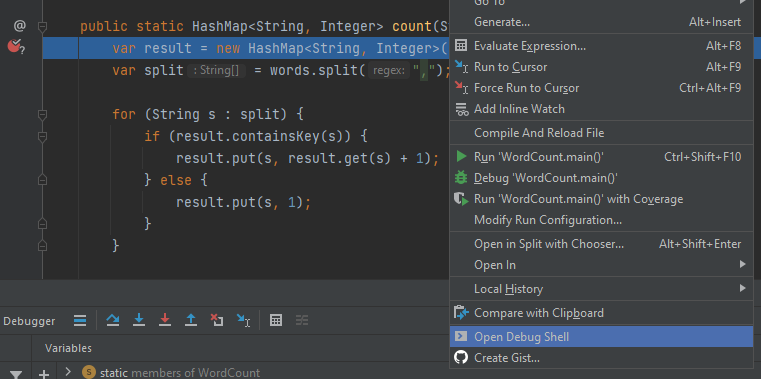

After that, you should see a new Debug tab: <code>Weevil Debugger Shell</code> in which you can write and evaluate 
expressions.

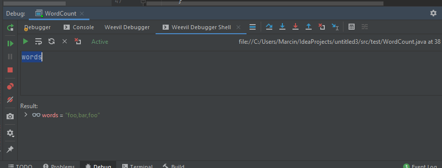

Shell provides several actions such as:
 - <code>Execute</code>: executes selected expression or whole code in shell editor,
 - <code>Inspect</code>: inspects selected expression,
 - <code>Refresh</code>: refreshes the shell (you may need to click this if shell loses debug context),
 - <code>Clear</code>: clears the shell editor
 - <code>Clear history</code>: clears evaluation history

#### Troubleshooting Debugger Shell

Use <code>Refresh</code> action when <code>Active</code> label turns into <code>Deprecated</code>. 
Also, always check if the file path and line position label is the same as current breakpoint/step position.

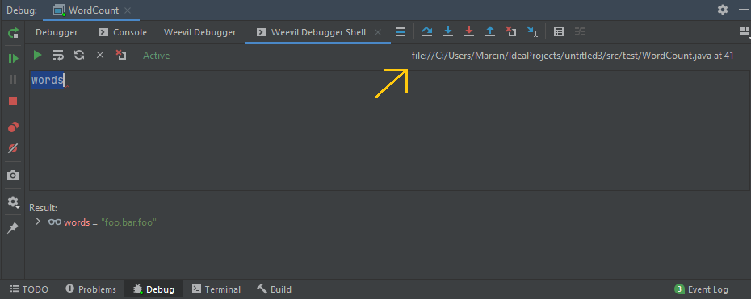

### Automatic closing debugged files

Files which were opened by breakpoint hit, step over, step into and step over action will be automatically closed. 
This will happen only when a file is not reachable by any JVM stack frame. 
Also, when you will stop Debug session, a prompt will show files which can be selected/unselected for closing.
This feature can be disabled in <code>Weevil Debugger Settings</code> (<code>Settings | Tools</code>). 
Disabling or enabling will be reflected in the next debug session.

### Search Variables

You can search debugger variables in two modes: <code>Expression</code> and <code>Code fragment</code>. 
It is similar to the existing Intellij Debugger Evaluator. 

To start searching right-click on desired variable in <code>Variables</code> view and click on <code>Search</code>:

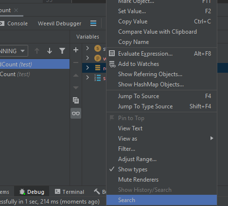

You can also start searching by clicking on inlay variable in the current editor:

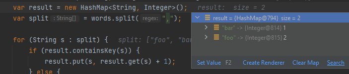

If you need to search for simple values such as: integers, strings etc. use <code>Expression</code> mode,
otherwise use <code>Code fragment</code> mode.
To select proper mode click on <code>Expand</code> button.

#### Expression search

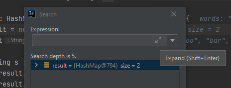

To search for desired value just write it in the input and hit <code>Search</code> button.

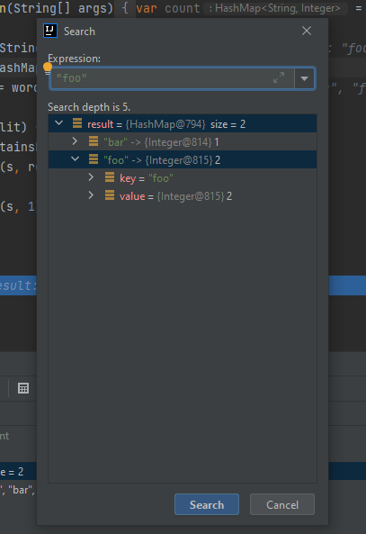

Search result (tree path) will be expanded and highlighted. 
Be aware that by default search depth is limited to 5 levels of object graph hierarchy. 
This is required because some JVM objects can hold cyclic references and searching process could take eternity.
Search depth can be changed in <code>Weevil Debugger Settings</code>.

#### Code Fragment search

In this mode we can do a more complex search. For example, we can check if a particular getter property matches 
our expression.
In <code>Code Fragment</code> mode you must operate on the <code>$it</code> variable and treat it as any object 
in the searched hierarchy.
Type of <code>$it</code> is <code>java.lang.Object</code> (or `Any` in Kotlin) so remember about type checking.

In the following example we can see a <code>Code Fragment</code> that will find all employees whose names 
are starting with <code>J</code>.

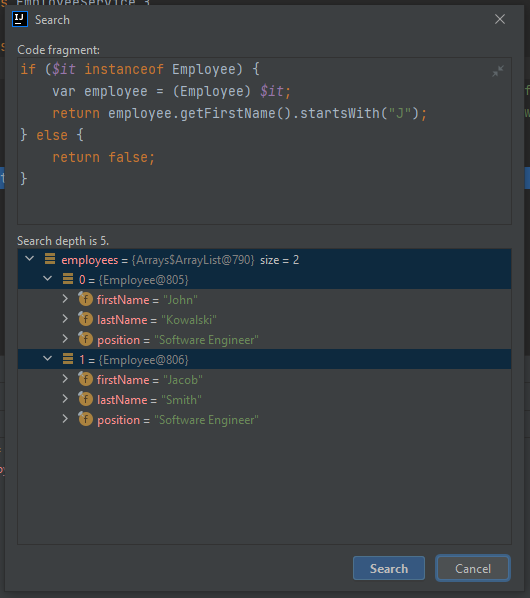

### Evaluate Future Code

You can evaluate future code from current suspension point. 
Evaluated code is limited by number of lines (by default 10) and can be changed in <code>Weevil Debugger Settings</code>.
After code evaluation you will see values in <code>Future values</code> view 
and inlay values at each end of line in the current editor.

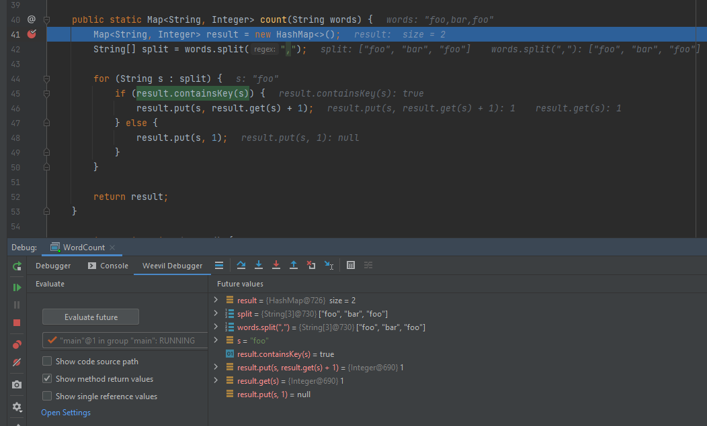

You can search evaluated values and also inspect their history. Each history entry will have proper index.

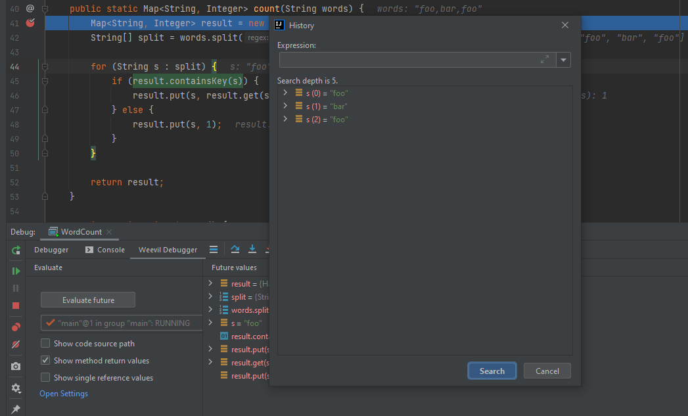

Boolean expressions can be highlighted in editor. For <code>true</code> value highlighted color will be green, 
for <code>false</code> value red. You can also view method return values and references.

#### Limitations

- At this moment only values for actual thread are showing.

- Future code evaluation should be invoked only on stateless code.

### Smart Breakpoints Setup

You can immediately set conditional breakpoint by clicking on the variable in <code>Variables</code> View
(or add a shortcut in <code>Keymap | Plugins | Weevil Debugger</code>):

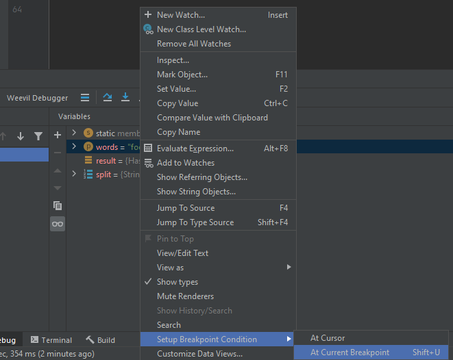

For JVM primitive types <code>==</code> operator will be used.
For <code>String</code> type <code>equals</code> method.

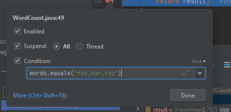

For any other type no operator will be used (only the variable name will be added in the <code>Condition</code> input). 

### Recursion Breakpoint

Intellij already provides functionality to add recursion breakpoint. 
The problem is that it can be set for 1 pass/iteration. 
Weevil Debugger provides possibility to use ranges and multiple passes (just like in printing pages).

By default, this feature is disabled, because it can be annoying to do a second click to add a regular Java breakpoint.

To add it, just click on desired line.

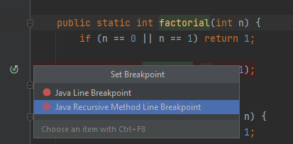

After clicking, provide information at which iterations breakpoint should suspend program execution.

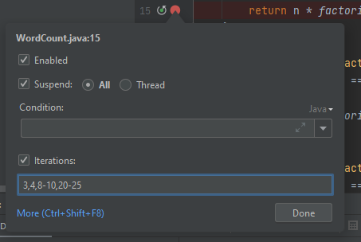

### Keymap

You can add shortcuts to Weevil Debugger actions in <code>Keymap | Plugins | Weevil Debugger</code>.

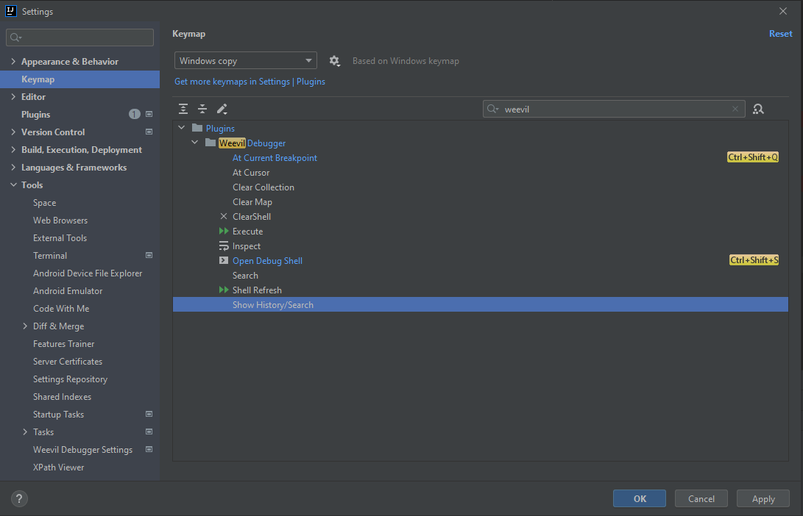

### Settings

Weevil Debugger Settings can be accessed in <code>Settings | Tools</code>.

- Max search depth (default 5) - depth of search in object hierarchy,
- Search timeout (in seconds, default 5) - timeout of searching process,
- History limit (default 10) - length of history for particular value/expression evaluated in future mode,
- Future evaluation limit (number of lines, default 10) - number of code lines which will be evaluated in future mode,
- Show code source path (by default NOT checked) - if checked, code source path will be visible next to class name 
  where program suspended,
- Allow recursion breakpoint (by default NOT checked) - if checked, can put breakpoint at desired line,
- Show method return values (by default NOT checked) - if checked, method return values will be visible during 
  future evaluation mode.
- Auto close unreachable files during debug (by default checked) - if checked, files which were opened during 
  breakpoint hit, step into, step out 
  and step over will be closed,
- Show prompt to close unreachable files during debug (by default checked) - if checked, prompt will be opened to select 
  files which can be closed.

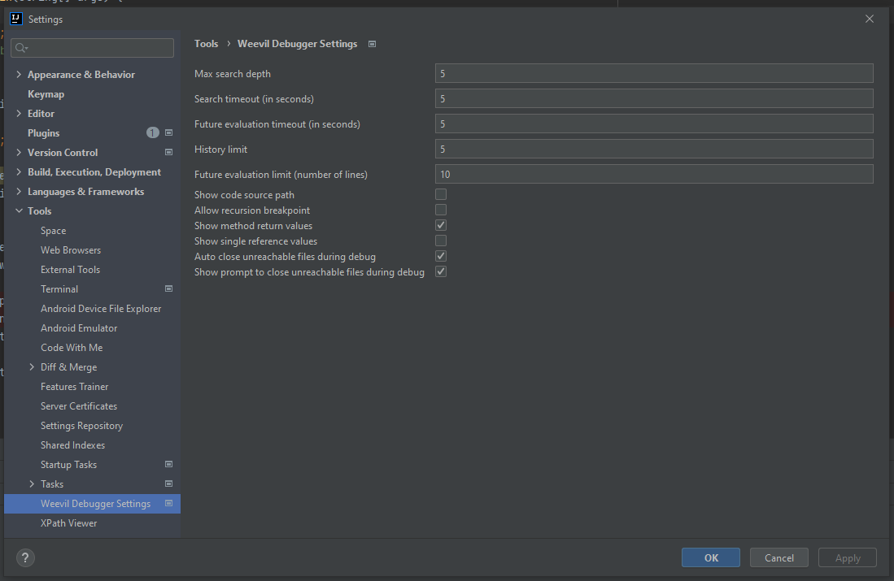

